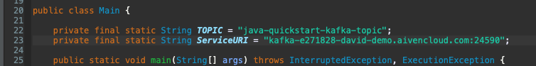
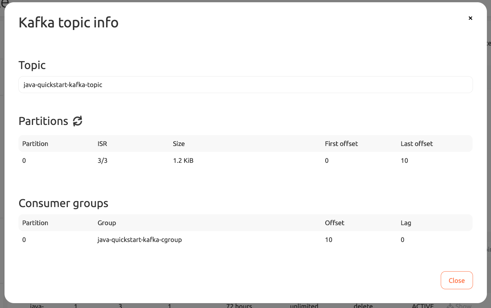

Time: 30 minutes \
Estimated Cost: ~\$5 (make sure to use \$300 free credits for new accounts)

# Setup

1. Go to ![rapu][rapu] [Aiven Console](https://console.aiven.io) and create a new Kafka "Business-4" service.
1. ![rapu][rapu] From the "Overview" tab of the kafka service, download the following items to the kafka quickstart directory. Keep the default file names.
   - Access Key => `java/quickstart-kafka/service.key`
   - Access Certificate: `java/quickstart-kafka/service.cert`
   - CA Certificate: `java/quickstart-kafka/ca.pem`
1. ... wait for the kafka cluster to start up 
1. ![rapu][rapu] Create `java-quickstart-kafka-topic` under the "Topics" tab on the Kafka service using the default configurations.
1. ![rapu][rapu] From the "Overview" tab copy the `Service URI` value.
1. Update `java/quickstart-kafka/src/main/java/io/aiven/sa/Main.java` to use your Service UI. Change the static string on line 23. 
1. ![terminal][terminal] Run the example.
1. ![rapu][rapu] From the "Topics" tab, click "Show Info" for your topic. You should see the offset for the topic partitions and consumer group as well as consumer group lag. Note that it might take a couple minutes for the consumer group to show up.
1. ![rapu][rapu] Clean up your Kafka service in the Aiven console to prevent further billing. You can "Delete" your service or just "Power Off" if you want to come back later.

## Add Credentials to Truststore and Keystore

Check out Aiven's official help documentation for [Getting Started with Aiven Kafka](https://help.aiven.io/en/articles/489572-getting-started-with-aiven-kafka)

```sh
# setup your secret values
# relies on `service.key` and `service.cert` in the root directory, specifically `java/quickstart-kafka/*`
openssl pkcs12 -export -inkey service.key -in service.key -out client.keystore.p12 -name service_key

# setup Aiven's trusted certificate
# relies on `ca.pem` in the root directory, specifically `java/quickstart-kafka/*`
keytool -import -file ca.pem -alias CA -keystore client.truststore.jks
```

# Running

Run the following command replacing the service URI with your value from above

```sh
mvn exec:java -Dexec.mainClass="io.aiven.sa.Main"
```

Example Output

```
[INFO] Scanning for projects...
[INFO]
[INFO] --------------------< io.aiven.sa:kafka-quickstart >--------------------
[INFO] Building kafka-quickstart 0.0.1-SNAPSHOT
[INFO] --------------------------------[ jar ]---------------------------------
[INFO]
[INFO] --- exec-maven-plugin:1.6.0:java (default-cli) @ kafka-quickstart ---

Connecting to cluster@kafka-e271828-david-demo.aivencloud.com:24590

Producer: Sending kafka message

Consumed: topic java-quickstart-kafka-topic partition=0 offset=15 key=e6eeb7b6-48ea-4498-8661-6af6f7dcf31f value=Hello Aiven Kafka, from Java!

Done! Cleaning up...
[INFO] ------------------------------------------------------------------------
[INFO] BUILD SUCCESS
[INFO] ------------------------------------------------------------------------
[INFO] Total time:  5.390 s
[INFO] Finished at: 2020-04-30T09:50:09-04:00
[INFO] ------------------------------------------------------------------------
```



[rapu]: ../../assets/rapu.png 'Rapu Icon'
[terminal]: ../../assets/terminal.png 'Terminal Icon'
