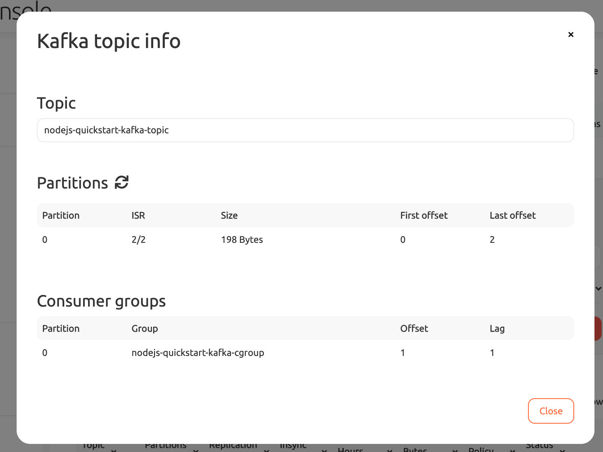

Time: 30 minutes \
Estimated Cost: ~\$5 (make sure to use \$300 free credits for new accounts)

# Setup

1. Go to ![rapu][rapu] [Aiven Console](https://console.aiven.io) and create a new Kafka "Business-4" service.
1. ![rapu][rapu] From the "Overview" tab of the kafka service, download the following items to the kafka quickstart directory. Keep the default file names.
   - Access Key => `nodejs/quickstart-kafka/service.key`
   - Access Certificate: `nodejs/quickstart-kafka/service.cert`
   - CA Certificate: `nodejs/quickstart-kafka/ca.pem`
1. ... wait for the kafka cluster to start up 
1. ![rapu][rapu] Create `nodejs-quickstart-kafka-topic` under the "Topics" tab on the Kafka service using the default configurations.
1. ![rapu][rapu] From the "Overview" tab copy the `Service URI` value.
1. ![terminal][terminal] Run the example.
1. ![rapu][rapu] From the "Topics" tab, click "Show Info" for your topic. You should see the offset for the topic partitions and consumer group as well as consumer group lag. Note that it might take a couple minutes for the consumer group to show up.
1. ![rapu][rapu] Clean up your Kafka service in the Aiven console to prevent further billing. You can "Delete" your service or just "Power Off" if you want to come back later.

# Running

Run the following command replacing the service URI with your value from above

```sh
ServiceURI=<<my-service-uri>> node main.js
# e.g. ServiceURI=david-kafka-474c5c6-david-demo.aivencloud.com:24590 node main.js
```

Example Output

```
Connecting to cluster@kafka-e271828-david-demo.aivencloud.com:24590


Starting consumer

{"level":"INFO","timestamp":"2020-04-30T09:20:29.720Z","logger":"kafkajs","message":"[Consumer] Starting","groupId":"nodejs-quickstart-kafka-cgroup"}
(node:93876) [DEP0123] DeprecationWarning: Setting the TLS ServerName to an IP address is not permitted by RFC 6066. This will be ignored in a future version.
{"level":"ERROR","timestamp":"2020-04-30T09:20:30.555Z","logger":"kafkajs","message":"[Connection] Response GroupCoordinator(key: 10, version: 1)","broker":"34.74.243.44:24590","clientId":"nodejs-quickstart-kafka-client","error":"The group coordinator is not available","correlationId":0,"size":55}
{"level":"ERROR","timestamp":"2020-04-30T09:20:30.902Z","logger":"kafkajs","message":"[Connection] Response GroupCoordinator(key: 10, version: 1)","broker":"34.74.243.44:24590","clientId":"nodejs-quickstart-kafka-client","error":"The group coordinator is not available","correlationId":1,"size":55}
{"level":"ERROR","timestamp":"2020-04-30T09:20:31.544Z","logger":"kafkajs","message":"[Connection] Response GroupCoordinator(key: 10, version: 1)","broker":"34.74.243.44:24590","clientId":"nodejs-quickstart-kafka-client","error":"The group coordinator is not available","correlationId":2,"size":55}
{"level":"INFO","timestamp":"2020-04-30T09:20:36.589Z","logger":"kafkajs","message":"[Runner] Consumer has joined the group","groupId":"nodejs-quickstart-kafka-cgroup","memberId":"nodejs-quickstart-kafka-client-78984604-8f04-4627-af82-2f191d5d8de6","leaderId":"nodejs-quickstart-kafka-client-78984604-8f04-4627-af82-2f191d5d8de6","isLeader":true,"memberAssignment":{"nodejs-quickstart-kafka-topic":[0]},"groupProtocol":"RoundRobinAssigner","duration":6867}

Producer: Sending kafka message


Consumer: Processing message

{
  topic: 'nodejs-quickstart-kafka-topic',
  partition: 0,
  offset: '0',
  value: 'Hello Aiven Kafka, from NodeJS!'
}

Consumer: committing offset: {"topic":"nodejs-quickstart-kafka-topic","partition":0,"offset":"0"}


Done! Cleaning up...

{"level":"INFO","timestamp":"2020-04-30T09:20:38.835Z","logger":"kafkajs","message":"[Consumer] Stopped","groupId":"nodejs-quickstart-kafka-cgroup"}
```



[rapu]: ../../assets/rapu.png 'Rapu Icon'
[terminal]: ../../assets/terminal.png 'Terminal Icon'
