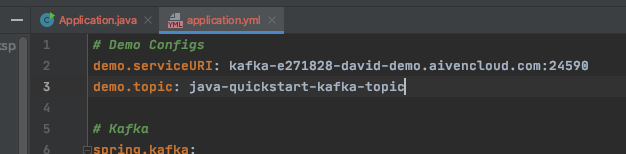

Time: 30 minutes \
Estimated Cost: ~\$5 (make sure to use \$300 free credits for new accounts)

# Overview

SpringBoot is an open-source enterprise Java framework that values "Convention over Configuration over Code`. They recognize that there is a lot of cost overhead and risk in writing code. This allows developers to leverage "reasonable defaults" to focus on the functionality that generates revenue.

We can leverage the [Spring Kafka](https://spring.io/projects/spring-kafka) library for
stream processing. Everything Spring needs to process a Kafka stream can be found in
`src/main/java/io/aiven/quick/kafka/Application.java` and `src/main/resources/application.yml`.

# Setup

1. Go to ![rapu][rapu] [Aiven Console](https://console.aiven.io) and create a new Kafka service.
1. ![rapu][rapu] From the "Overview" tab of the kafka service, download the following items to the kafka quickstart directory. Keep the default file names.
   - Access Key => `springboot/quickstart-kafka/service.key`
   - Access Certificate: `springboot/quickstart-kafka/service.cert`
   - CA Certificate: `springboot/quickstart-kafka/ca.pem`
1. ![terminal][terminal] Create the Keystore and Truststore following steps below.
1. ![rapu][rapu] ... wait for the kafka cluster to start up 
1. ![rapu][rapu] Create `java-quickstart-kafka-topic` under the "Topics" tab on the Kafka service using the default configurations.
1. ![rapu][rapu] From the "Overview" tab copy the `Service URI` value.
1. Update `springboot/quickstart-kafka/src/main/resources/application.yml` to use your Service URI. Change the config on line 2. 
1. ![terminal][terminal] Run the example.
1. ![rapu][rapu] From the "Topics" tab, click "Show Info" for your topic. You should see the offset for the topic partitions and consumer group as well as consumer group lag. Note that it might take a couple minutes for the consumer group to show up.
1. ![rapu][rapu] Clean up your Kafka service in the Aiven console to prevent further billing. You can "Delete" your service or just "Power Off" if you want to come back later.

## [Step 3] Add Credentials to Truststore and Keystore

Check out Aiven's official help documentation for [Getting Started with Aiven Kafka](https://help.aiven.io/en/articles/489572-getting-started-with-aiven-kafka)

```sh
# setup your secret values
# relies on `service.key` and `service.cert` in the root directory, specifically `java/quickstart-kafka/*`
openssl pkcs12 -export -inkey service.key -in service.cert -out client.keystore.p12 -name service_key
# > Enter Export Password: secret
# > Verifying - Enter Export Password: secret

# setup Aiven's trusted certificate
# relies on `ca.pem` in the root directory, specifically `java/quickstart-kafka/*`
keytool -import -file ca.pem -alias CA -keystore client.truststore.jks
# > Enter keystore password: secret
# > Re-enter new password: secret
# > ...
# > Trust this certificate? [no]:  YES
# > Certificate was added to keystore
```

# [Step 8] Running

Run the following command replacing the service URI with your value from above

```sh
./mvnw spring-boot:run
```

Example Output

```
  .   ____          _            __ _ _
 /\\ / ___'_ __ _ _(_)_ __  __ _ \ \ \ \
( ( )\___ | '_ | '_| | '_ \/ _` | \ \ \ \
 \\/  ___)| |_)| | | | | || (_| |  ) ) ) )
  '  |____| .__|_| |_|_| |_\__, | / / / /
 =========|_|==============|___/=/_/_/_/
 :: Spring Boot ::        (v2.2.6.RELEASE)

...

2020-05-01 10:06:18.393  INFO 39288 --- [           main] io.aiven.quick.kafka.Application         : Started Application in 3.352 seconds (JVM running for 3.903)
2020-05-01 10:06:18.394  INFO 39288 --- [           main] io.aiven.quick.kafka.Application         : Connecting to cluster@kafka-e271828-david-demo.aivencloud.com:24590

...

2020-05-01 10:06:22.296  INFO 39288 --- [ntainer#0-0-C-1] io.aiven.quick.kafka.Application         : Consumed: topic=java-quickstart-kafka-topic partition=0 offset=9 key=983a3aae-060b-42b2-abbd-b0ec2b5ea522 value=Hello Aiven Kafka, from SpringBoot!
2020-05-01 10:06:22.296  INFO 39288 --- [           main] io.aiven.quick.kafka.Application         : Done! Cleaning up...

...
```

# [Step 9] Topic + Consumer Lag Info


[rapu]: ../../assets/rapu.png 'Rapu Icon'
[terminal]: ../../assets/terminal.png 'Terminal Icon'
